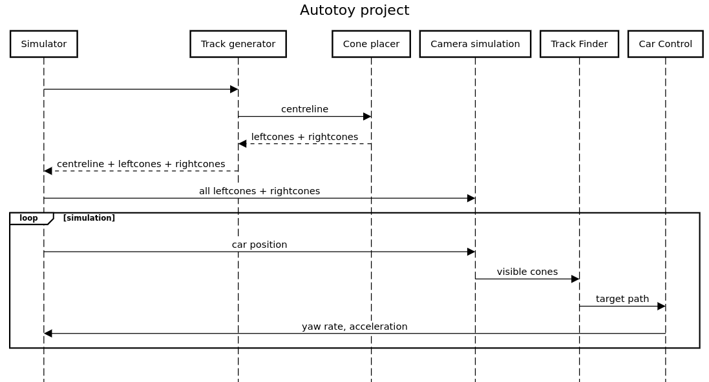

#Autotoy
In this project a full driverless-software pipeline is simulated. 
The goal of this project is to learn ROS.

## High level project flow.
First a centreline is generated, next the cones along the centreline are placed. 
This track is the input for the simulation.
The initial car location and heading together with all cone locations is passed to a camera simulator.
This camera simulator chooses a subset of cones that the car sees.
These cone locations are passed to the track finder which tries to find the centre-line between the cones. This is called the target path.
Next, the car-controller will take the current position and heading of the car together with the target path and come up with the yaw rate and acceleration of the car.
This is passed back to the simulator which will move the virtual car accordingly.
The new location of the car is passed to the camera simulation and the whole thing will start over.
Graphically, the above flow looks like this: 


```https://sequencediagram.org
title Autotoy project

Simulator->Track generator:
Track generator->Cone placer:centreline
Track generator<--Cone placer:leftcones + rightcones

Simulator<--Track generator:centreline + leftcones + rightcones
Simulator->Camera simulation:all leftcones + rightcones
loop simulation
  Simulator->Camera simulation:car position
  Camera simulation->Track Finder:visible cones
  Track Finder->Car Control:target path
  Car Control->Simulator:yaw rate, acceleration
end
```

### Teams
#### Simulation
Sijmen, Mundi, David
#### Track & Cone generation
Ben, Oscar, Orestis
#### Camera Simulation
Pietro
#### Track Finder
Alex, Gailey, Jules
#### Controls
Mees, Philip

## Components specification
Here every component's interface is further specified.
This information should be enough to implement each node independently.

### Message types
*track/Point.msg*
Values are in meters.
```
float32 x
float32 y
```

*track/Cone.msg*
0 is blue cone (left) and 1 is yellow cone (right)
```
track/Point position
int64 color 
```

*track/Cones.msg*
```
track/Cone[] cones
```

*track/Line.msg*
```
track/Point[] points
```

*track/Track.msg*
```
track/Line centreline
track/Cones cones
```

*car/Location.msg*
heading in radians, with respect to the x-axis
```
track/Point location
float32 heading
```

*car/Control.msg*
* acceleration is m/s^2
* yawrate is rad/sec
```
float32 acceleration
float32 yawrate
```

### Topic definitions
| Topic name | Description | Message type | 
|---|---|---|

| `/car/location` | The location of the car will be published here. | `car/Location.msg` |
| `/track/cones` | Publishes all the cones of the track | `track/Cones.msg` |
| `/car/camera` | The cones visible to the car will be published here. | `track/Cones.msg` |
| `/car/targetline` | The line that the car should be following. | `track/Line.msg` |
| `/car/controls` | Commands how the car should move. | `car/Control.msg` |

### Nodes

### Track generator
* package: track
* node name: generator
* node type: [service](http://wiki.ros.org/srv)
* service name: `/track/generate`
definition of `Generator.srv`:
```

---
track/Track track
```

#### Track cone placer
* package: track
* node name: coneplacer
* node type: [service](http://wiki.ros.org/srv)
* service name: `/track/coneplacer`
* service definition `ConePlacer.srv`
```
track/Line centreline
---
track/Cones cones
```

#### Car: camera simulation
* package: car
* node name: camerasimulator
* node type: [topic](http://wiki.ros.org/Topics)
* Listens on topic `/track` to receive a new track. It will store this track in memory for future usage.
* Listens on topic `/car/location` to receive the location of the car. 
  When received, it will find the cones that are currently visible and send the result to the `/car/camera` topic. 

#### Car: track finder
* package: car
* node name: trackfinder
* node type: [topic](http://wiki.ros.org/Topics)
* Subscribed to topic `/car/camera` and will try to find the centre line of the track. 
  Publishes the result to `/car/targetline` topic.

#### Car: controller
* package: car
* node name: controller
* node type: [topic](http://wiki.ros.org/Topics)
* Subscribed to topic `/car/targetline` for updates on the projected line and 
  subscribed to topic `/car/location` for the location and heading of the car.
  This node calculates the new yawrate and acceleration of the car every time a message is received on one of the previously mentioned topics.
  Publishes the result to `/car/controls`.

#### Simulator
* package: simulator
* node name: god
* node type: [topic](http://wiki.ros.org/Topics)
When the node starts it requests a new track from the `/track/generate` service.
The new track is published on `/track`.
Next, the start-position of the car is published on `/car/location`.
Now it waits for messages on the `/car/controls` topic.
When a control command is received the car will be moved accordingly.

## Development
To test the software being developed first run `echo "source <dir-of-autotoy>/devel/setup.bash" >> ~/.bashrc`. In a new terminal, navigate to the catkin workspace (this folder) and build the project with `catkin_make`.

Whenever a change to the source code is made, there are a few common options to compile the code. One is the combination `catkin clean` followed by `catkin build` which wipes out the *build, devel and logs* folders and builds everything again. The other option which is used in the tutorials is to run `catkin_make` once. In some cases, like when the *devel* folder with the header files does not exist, some of these commands might have to be run twice.

## Running
To run the project, start a ROS Master and run every node. Start the simulator last. Each should be started from a separate console:
```
roscore

rosrun track generator
rosrun track coneplacer
rosrun car camerasimulator
rosrun car trackfinder
rosrun car controller

rosrun simulator god
```


## Lessons learned
* Would issues and features helped us?
* Running in a Docker environment to not have issues of "runs on my machine" as experienced by Jules and David. 
* Continous integration (or some basic unit tests) to make sure that master never has bugs and can be compiled (which was not the case after the PR from Sijmen and Edmundo) with the weird `include`.
* Doing more frequent pull requests to master with updated msg, package and CMakeLists files which everyone has to share. 
* Push code immendiately, especially before a period of absence.
* More frequent PR to Master

